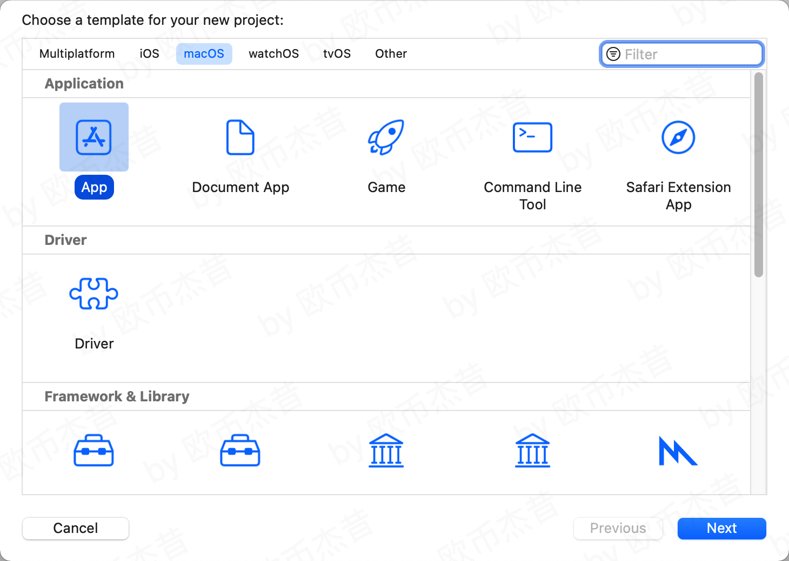
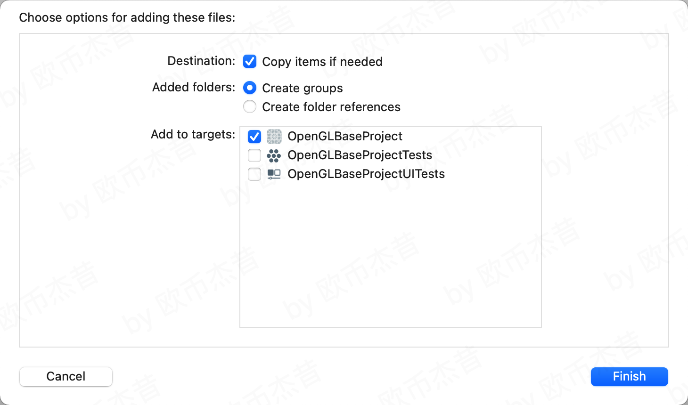
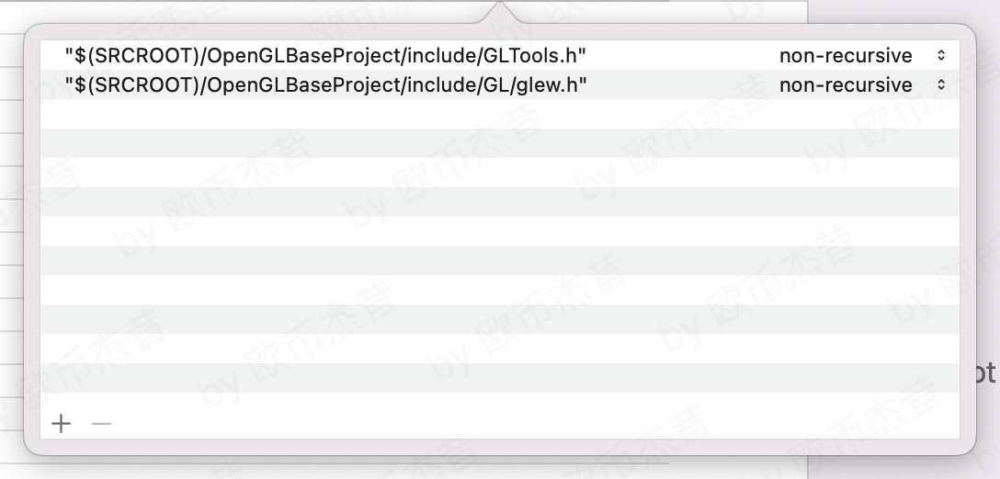
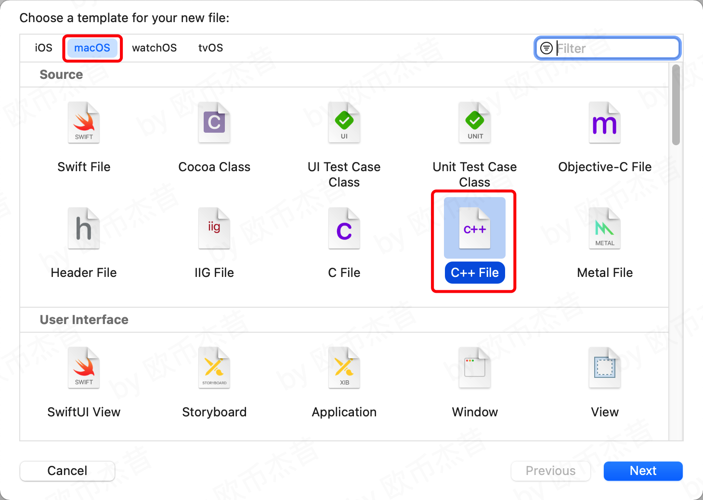
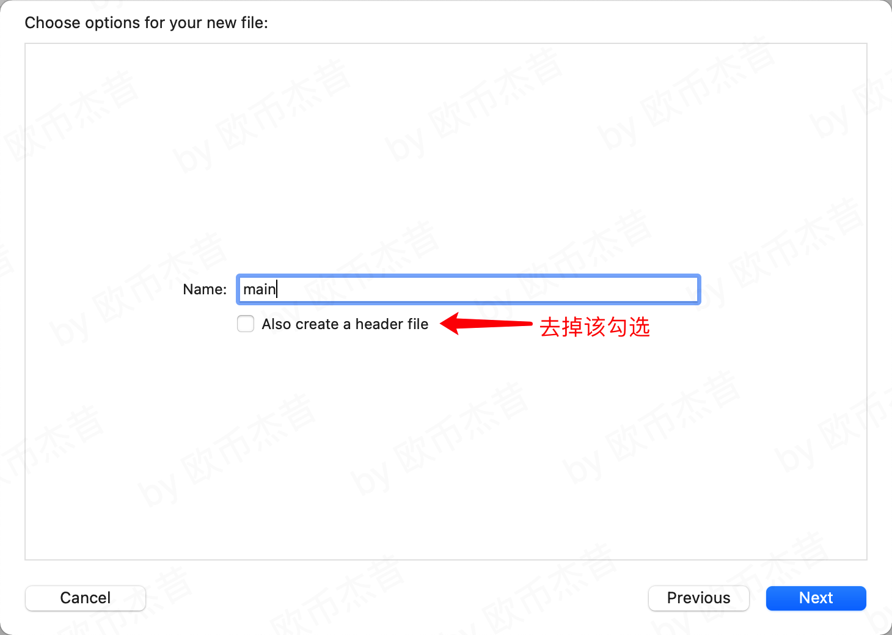

# OpenGLBaseProject

## OpenGL-Mac下环境搭建
### 准备资源
- OpenGL资源
```
百度网盘：
链接: https://pan.baidu.com/s/1kNUhXGpgL58MhaDfCRtJvQ 提取码: ajw2
``` 
- 测试代码
```
百度网盘：
链接: https://pan.baidu.com/s/1aJpTsc-ewNi72Buo3Cf_JQ 提取码: d9bc 
```

### 步骤

- 新建项目，使用macOS -> App 创建


- 添加OpenGl.framework 和 GLUT.framework 两个系统库

- 将include文件夹和libGLTools.a拖到项目里



- 在Bulid Settings 输入Header Search path 中拖入CLTool.h 和 glew.h 生成路径

- 将libGLTools.a文件直接拖到Frameworks文件夹

- 删掉几个选中文件

- 创建main.cpp文件







- 测试环境是否成功
复制代码到main.cpp中

此时编译会发现报错


将文件“< >”系统引入，改为“ ”普通引入，重新编译

如果报错：
ld: library not found for -lGLTools clang: error: linker command failed with

在Build Phases -> Link Binary With Libraries中将libGLTool.a删掉，重新加入（使用Add Other）

编译成功后运行，看到如下结果就说明成功了



#### 感谢 @CC老师_HelloCoder 的分享